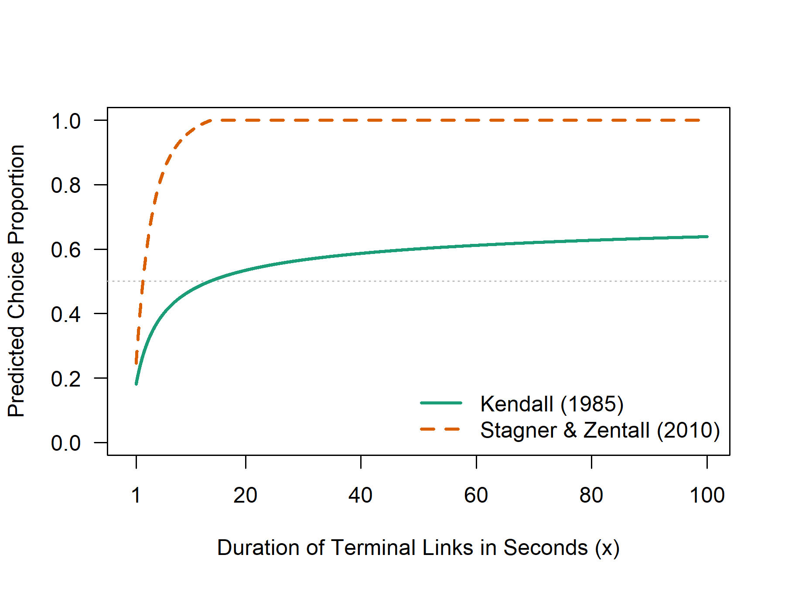

<!-- README.md is generated from README.Rmd. Please edit that file -->

# SiGN

<!-- badges: start -->

<!-- badges: end -->

## Overview

SiGN is an R package that implements the Signals for Good News (SiGN)
model to compute behavioural predictions in common operant choice
paradigms.

## Installation

You can install the development version of SiGN from
[GitHub](https://github.com/) with:

``` r
# install.packages("pak")
pak::pak("jpisklak/SiGN")
```

## Usage

``` r
library(SiGN)

# Load built-in profile and customize parameters
tl_durs <- seq(1, 100, by = 0.01)

kendall <- choice_params("kendall",
  tl_dur_a1 = tl_durs, tl_dur_a2 = tl_durs,
  tl_dur_b1 = tl_durs, tl_dur_b2 = tl_durs
)

zentall <- choice_params("zentall",
  tl_dur_a1 = tl_durs, tl_dur_a2 = tl_durs,
  tl_dur_b1 = tl_durs, tl_dur_b2 = tl_durs
)

# Generate predictions
kendall_pred <- SiGN(kendall)
zentall_pred <- SiGN(zentall)
```



## Available Data and Profiles

The package includes:

- Built-in parameter profiles (e.g., `"zentall"`, `"kendall"`,
  `"fantino"`) for Stagner and Zentall (2010); Kendall (1985); and
  Fantino (1969) respectively.

- Data sets `subopt_avian` and `subopt_full`, compiled from Dunn et al.
  (2024).

## References

<div id="refs" class="references csl-bib-body hanging-indent"
entry-spacing="0">

<div id="ref-Dunn_et_al_2024" class="csl-entry">

Dunn, R. M., Pisklak, J. M., M. A. McDevitt, and M. L. Spetch. 2024.
“Suboptimal Choice: A Review and Quantification of the Signal for Good
News (SiGN) Model.” *Psychological Review* 131 (1): 58–78.
<https://doi.org/10.1037/rev0000416>.

</div>

<div id="ref-Fantino_1969" class="csl-entry">

Fantino, E. 1969. “Choice and Rate of Reinforcement.” *Journal of the
Experimental Analysis of Behavior* 12 (5): 723–30.
<https://doi.org/10.1901/jeab.1969.12-723>.

</div>

<div id="ref-Kendall_1985" class="csl-entry">

Kendall, S. B. 1985. “A Further Study of Choice and Percentage
Reinforcement.” *Behavioural Processes* 10 (4): 399–413.
<https://doi.org/10.1016/0376-6357(85)90040-3>.

</div>

<div id="ref-Stagner_Zentall_2010" class="csl-entry">

Stagner, J. P., and T. R. Zentall. 2010. “Suboptimal Choice Behavior by
Pigeons.” *Psychonomic Bulletin & Review* 17 (3): 412–16.
<https://doi.org/10.3758/PBR.17.3.412>.

</div>

</div>
