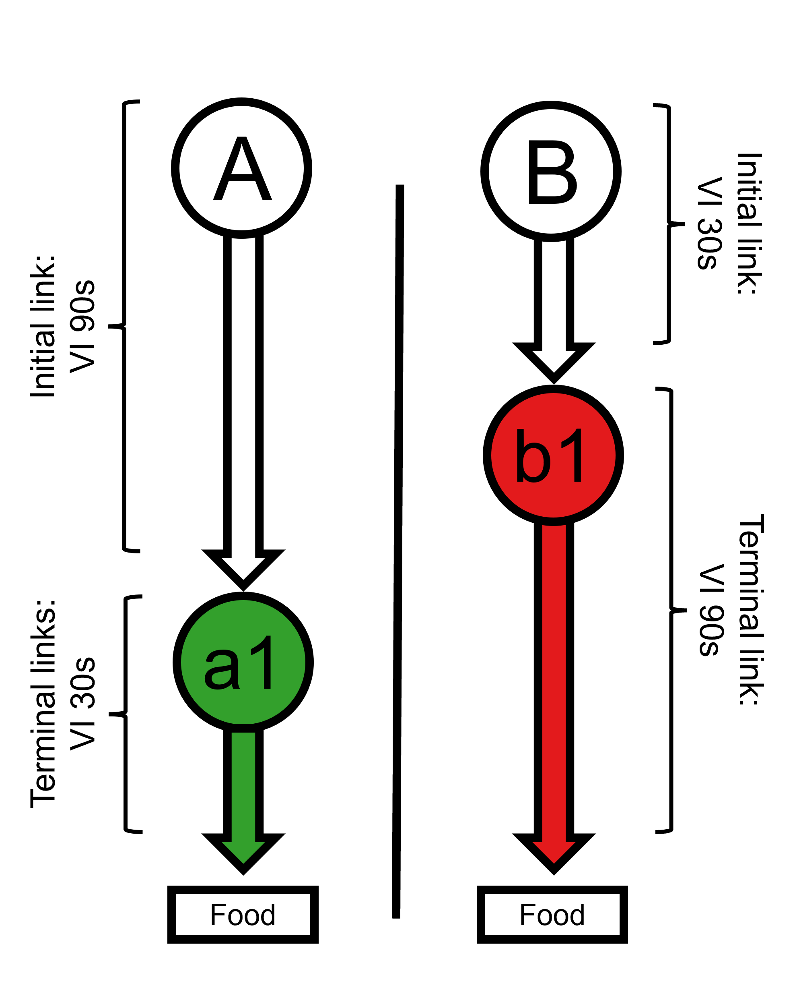

```{r, include = FALSE}
knitr::opts_chunk$set(
  collapse = TRUE,
  comment = "#>"
)
```

<figure style="float: left; padding: 10px; width: 40%;">
  
  <figcaption style="text-align: center;"><strong>Figure 1.</strong> Fantino (1969) contingencies</figcaption>
</figure>

<br>

A useful feature of the SiGN model is its ability to generate predictions for classic concurrent-chain procedures—that is, setups involving a single, deterministic terminal link and outcome for each alternative. These simpler arrangements were commonly used in early demonstrations of the delay-reduction hypothesis and choice behaviour more generally. 

## Reproducing Predictions from Fantino (1969)

For example, consider the contingencies used in Fantino's (1969) seminal paper (diagrammed in Figure 1), which were designed to illustrate how delay reduction can conditionally reinforce choice behaviour (Fantino, 1969).

In this setup, each initial link leads to a single terminal link, and terminal reinforcement is always delivered once the schedule requirements are met. The parameters required to model this arrangement are already stored in the built-in `"fantino"` profile.

```{r}
library(SiGN)
fantino_1969 <- choice_params("fantino", display_params = TRUE)
```

Because the `SiGN()` function assumes two terminal links per alternative by default, the second terminal link on each side is effectively deactivated by setting its duration and entry probability to zero (i.e., `tl_dur_a2`, `tl_dur_b2`, `tl_p_a2`, and `tl_p_b2` are all set to 0).

Running the model yields the following prediction:

```{r}
SiGN(fantino_1969)
```

... we can see that we obtain a choice proportion of 0.9, which is what Fantino predicted with his original delay reduction hypothesis (Fantino, 1969).

## Reproducing Predictions from Squires and Fantino (1971)

A key feature of the SiGN model is that it does not rely solely on delay reduction to predict choice behaviour. Instead, it incorporates the approach proposed by Squires and Fantino (1971), in which delay reduction is multiplied by the rate of terminal reinforcement. In classic concurrent-chain arrangements—with a single, deterministic terminal link and outcome per alternative—this formulation yields predictions that align exactly with theirs.

Using the SiGN package, we can reproduce the model predictions presented in Figure 1 of Squires and Fantino's (1971) paper. These predictions illustrate how changes to the initial link (IL) duration influence choice behaviour in classic concurrent-chain arrangements.

In one example, Squires and Fantino compared chains with identical terminal links (TLs) but different fixed IL durations: Chain VI$x$ VI30 versus Chain VI$x$ VI90.

```{r message = FALSE}
# Squires and Fantino: VIx VI30 vs VIx VI90
sf_1_params <- choice_params("fantino",
  il_dur_a = seq(1, 600, 0.1),
  il_dur_b = seq(1, 600, 0.1)
)
```

In another example, the comparison is between Chain VI60 VI15 and Chain VI$x$ VI15. Here, the terminal links are held constant (15 s on both sides), while only the initial link duration of one alternative is manipulated. Critically, a prediction based purely on delay reduction would predict indifference (0.5) in this situation because the two terminal links represent the same degree of improvement to terminal reinforcement. This highlights the significance of Squires and Fantino’s (1971) extension to the delay-reduction model, which incorporates both delay-reduction and reinforcement rate to explain preference.

```{r message = FALSE}
# Squires and Fantino: VI60 VI15 vs VIx VI15
sf_2_params <- choice_params(

  # Initial link (il) duration (dur)
  il_dur_a = 60,
  il_dur_b = seq(1, 600, 0.1),

  # Terminal link (tl) duration (dur)
  tl_dur_a1 = 15, tl_dur_a2 = 0,
  tl_dur_b1 = 15, tl_dur_b2 = 0,

  # Terminal link (tl) entry probability (p)
  tl_p_a1 = 1, tl_p_a2 = 0,
  tl_p_b1 = 1, tl_p_b2 = 0,

  # Terminal reinforcement (tr) probability (p)
  tr_p_a1 = 1, tr_p_a2 = 0,
  tr_p_b1 = 1, tr_p_b2 = 0,

  # Schedules
  il_sched_a = "VI",
  il_sched_b = "VI",
)
```

```{r}
# Generate SiGN Prediction
sf_1 <- SiGN(sf_1_params)$details
sf_2 <- SiGN(sf_2_params)$details
```

```{r fig.width = 6, fig.height = 4.5, dpi = 300, fig.align = 'center', out.width = '75%'}
# Plot Predictions
plot(sf_1_params$il_dur_a, sf_1$cp,
  type = "n", las = 1,
  xlim = c(0, 600), ylim = c(0, 1),
  xaxt = "n",
  xlab = "Duration of Initial Links in Seconds (x)",
  ylab = "Predicted Choice Proportion"
)

axis(1, at = c(1, seq(100, 600, 100)))

abline(h = 0.5, lwd = 1, lty = 3, col = "grey")

lines(sf_1_params$il_dur_a, sf_1$cp,
  lwd = 2.5, lty = 1,
  col = palette.colors(palette = "Dark 2")[1]
)
lines(sf_2_params$il_dur_b, sf_2$cp,
  lwd = 2.5, lty = 2,
  col = palette.colors(palette = "Dark 2")[2]
)

legend("bottomright",
  legend = c("VIx VI 30 vs VIx VI 90", "VI60 VI 15 vs VIx VI 15"),
  lwd = c(2.5),
  lty = c(1, 2),
  col = palette.colors(palette = "Dark 2")[1:2],
  bty = "n"
)
```

The plot shows that the SiGN model reproduces the patterns reported by Squires and Fantino (1971), illustrating how SiGN integrates both delay-reduction and terminal reinforcement rate to account for classic choice behaviour, replicating foundational findings from early concurrent-chain research.

## References

Fantino, E. (1969). Choice and rate of reinforcement. *Journal of the Experimental Analysis of Behavior*, *12*(5), 723–730. https://doi.org/10.1901/jeab.1969.12-723

Squires, N., & Fantino, E. (1971). A model for choice in simple concurrent and concurrent-chains schedules. *Journal of the Experimental Analysis of Behavior*, *15*(1), 27–38. https://doi.org/10.1901/jeab.1971.15-27
